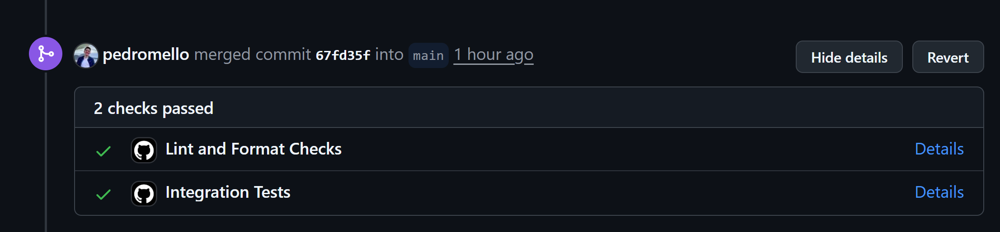

# Webhook Ledger Service (Go + PostgreSQL + MVC)

This project is a high-performance, financially precise ledger service implemented in Go. It utilizes PostgreSQL for persistent storage and Chi (`go-chi`) for HTTP routing. The service processes signed webhook transactions and aggregates user balances with arbitrary decimal precision under concurrent and secure conditions.

---

## 🚀 Getting Started (Quick Start)

The fastest and easiest way to spin up the application local environment with all dependencies pre-configured is using **Docker Compose**:

```bash
docker compose up --build
```

### What does this command do automatically?

1. Starts the PostgreSQL 16 database and runs healthchecks.
2. Compiles the Go application statically (using a multi-stage Docker build).
3. **Automatically executes database migrations** to set up tables and constraints.
4. Exposes the HTTP API on port `8080`.

---

## 🛠️ Architectural & Design Decisions

> This section details the architectural choices made to ensure code quality, ease of evaluation, and operational robustness.

### 1. MVC Architecture (Model-View-Controller)

To ensure a clean separation of concerns, the project strictly adheres to the classical MVC pattern:

- **Model (`pkg/models`)**: Manages the physical state of the database, ACID transactions, and structured queries. All persistence and lock contention logic resides here.
- **View (`pkg/views`)**: Controls the serialization and external representation of response payloads (e.g., converting `decimal.Decimal` to `string` in JSON outputs to prevent floating-point precision loss on the client side).
- **Controller (`pkg/controllers`)**: Orchestrates the flow of data. It intercepts incoming HTTP requests, invokes input validation, calls the appropriate Models, and returns the corresponding Views.

### 2. Automatic Migrations with PostgreSQL Advisory Locks

Database schema migrations (`db/migrations`) are embedded at compile time using the Go `//go:embed` directive and **executed automatically on application startup** (within `models.InitDB`).

- **Concurrency Safety**: To prevent DDL race conditions when multiple instances of the application start concurrently (such as in parallel test suites or distributed deployments), we acquire a transaction-level advisory lock (`SELECT pg_advisory_xact_lock(42069)`). This guarantees atomic schema migration per database instance.

### 3. Test Orchestrator (`tests/orchestrator.go`)

To avoid code duplication (DRY) and ensure absolute isolation of integration tests, we created a custom **Test Orchestrator** ([orchestrator.go](tests/orchestrator.go)).

- It abstracts heavy infrastructure operations such as managing database connection pools, running migrations on demand, cleaning up tables (`TRUNCATE TABLE` with cascade) between test runs, seeding mock balances, and performing direct database queries for physical assertions.

### 4. Intentional Submission of `.env.development`

The local configuration file `.env.development` **was intentionally committed to the Git repository**.

- **Zero Friction**: This decision was made to simplify evaluation. The reviewer does not need to manually configure or rename environment files to run tests or start the server for the first time.

### 5. Input Filtering in Controllers (`filterInput`)

Input validation (such as checking for empty parameters, invalid types, and parsing decimal values) is isolated inside a private helper method called `filterInput` on each controller.

- This keeps the main HTTP handler functions clean, readable, and focused on control flow, delegating request payload sanitization and constraint checking to a single-responsibility function.

### 6. Strict Linting & CI Workflow

- **Linter (`golangci-lint`)**: A rigorous [`.golangci.yml`](.golangci.yml) file is configured to run static analysis, formatting checks (`gofmt`), unused code checks, and warning controls (like missing error checks).
- **CI (GitHub Actions)**: We configured a GitHub Actions workflow ([`ci.yml`](.github/workflows/ci.yml)) that, on every push or pull request, provisions an isolated PostgreSQL service container, checks code formatting, runs the linter, and executes all integration tests.



---

## 📂 Folder Structure

```
kiichain-assessment/
├── .github/workflows/
│   └── ci.yml              # Automated CI workflow (Linter + Tests)
├── cmd/
│   └── server/
│       └── main.go         # API Entrypoint (Initializes DB, Router, and HTTP Server)
├── config/
│   └── config.go           # Environment variables loader with fallback defaults
├── db/
│   └── migrations/
│       ├── 000001_init.up.sql  # SQL schema migrations (ledger_entries, balances)
│       └── migrations.go       # Embeds migration queries at compile-time
├── pkg/
│   ├── controllers/        # C: Controllers (intercepts HTTP request, invokes filterInput)
│   │   ├── webhook_controller.go
│   │   └── balance_controller.go
│   ├── middleware/         # HTTP Middlewares (HMAC validation, custom headers, logging)
│   │   ├── auth.go
│   │   ├── headers.go
│   │   └── logger.go
│   ├── models/             # M: Models (Database connection, ledger entries, and balance queries)
│   │   ├── db.go
│   │   ├── ledger_entry.go
│   │   └── balance.go
│   └── views/              # V: Views (Serialization with float/decimal precision preservation)
│       └── response.go
├── tests/
│   ├── integration/        # Integration tests running against a real Postgres DB
│   │   ├── balance/
│   │   │   └── get_test.go
│   │   └── webhook/
│   │       └── post_test.go
│   └── orchestrator.go     # Orchestration helper to clean/seed database during tests
├── .env.development        # Environment configurations (committed intentionally)
├── .golangci.yml           # Strict static analysis configuration rules
├── Dockerfile              # Production multi-stage Docker build
├── docker-compose.yml      # Local dev environment orchestration
└── run.sh                  # Bash script simulating E2E calls using curl & openssl
```

---

## ⚙️ Environment Variables

| Variable            | Description                                                   | Default      |
| :------------------ | :------------------------------------------------------------ | :----------- |
| `PORT`              | HTTP Port the server listens on                               | `8080`       |
| `HMAC_SECRET`       | Symmetric key used to sign and verify request payloads        | _(Required)_ |
| `TOLERANCE_MINUTES` | Time window tolerance in minutes to reject expired timestamps | `5`          |
| `DB_HOST`           | Hostname of the Postgres DB                                   | `localhost`  |
| `DB_PORT`           | Port of the Postgres DB                                       | `5432`       |
| `DB_USER`           | Username for the Postgres DB                                  | `postgres`   |
| `DB_PASSWORD`       | Password for the Postgres DB                                  | `postgres`   |
| `DB_NAME`           | Name of the database to connect to                            | `ledger`     |
| `DB_SSLMODE`        | SSL Mode connection setting                                   | `disable`    |

---

## 📖 API Documentation

### 1. Update Ledger Webhook

- **Endpoint**: `POST /webhook`
- **Security Headers**:
  - `X-Timestamp`: Unix Timestamp in seconds of when the request was initiated.
  - `X-Nonce`: Unique string identifier to prevent replay attacks (single-use).
  - `X-Signature`: Hex-encoded HMAC-SHA256 signature of the payload.
- **Signature Signature Format**:
  `payload = X-Timestamp + "\n" + X-Nonce + "\n" + <raw_body_bytes>`
- **Request Body Example (JSON)**:
  ```json
  {
    "user": "user_alice",
    "asset": "ETH",
    "amount": "1.500000000000000000"
  }
  ```
- **HTTP Responses**:
  - `200 OK`: Transaction recorded and balance consolidated successfully.
  - `400 Bad Request`: Expired timestamp, missing headers, or malformed JSON.
  - `401 Unauthorized`: Invalid HMAC signature.
  - `409 Conflict`: Replay attack detected (nonce already processed).

### 2. Query Consolidated User Balances

- **Endpoint**: `GET /balance/{user}`
- **Response Example (200 OK)**:
  ```json
  {
    "user": "user_alice",
    "balances": {
      "ETH": "1.500000000000000000"
    }
  }
  ```
  _(Note: If the requested user does not exist in the database, the API returns a success response with an empty balances object: `{"user":"unknown_user","balances":{}}`)._

---

## 🧪 Verification & Integration Testing

### 1. Run Integration Tests

To execute automated integration tests checking concurrency safety, replay protection, and 18-decimal-place float precision:

1. Start only the PostgreSQL database container:
   ```bash
   docker compose up -d db
   ```
2. Run the Go test suite:
   ```bash
   go test -p 1 -count=1 -v ./tests/integration/...
   ```

### 2. Run E2E Simulation Script

We provide a helper script (`run.sh`) that triggers signed HTTP curl requests using your local OpenSSL library:

```bash
chmod +x run.sh
./run.sh
```

The script validates the following sequence:

1. Queries initial empty balance (`{}`).
2. Processes a valid deposit of `1500.50 USDT`.
3. Blocks a **Replay Attack** by resending the same nonce (expects `409 Conflict`).
4. Blocks an invalid signature payload (expects `401 Unauthorized`).
5. Blocks an expired request timestamp (expects `400 Bad Request`).
6. Processes a valid deduction of `500.25 USDT`.
7. Asserts the final balance is exactly `1000.25 USDT`.
